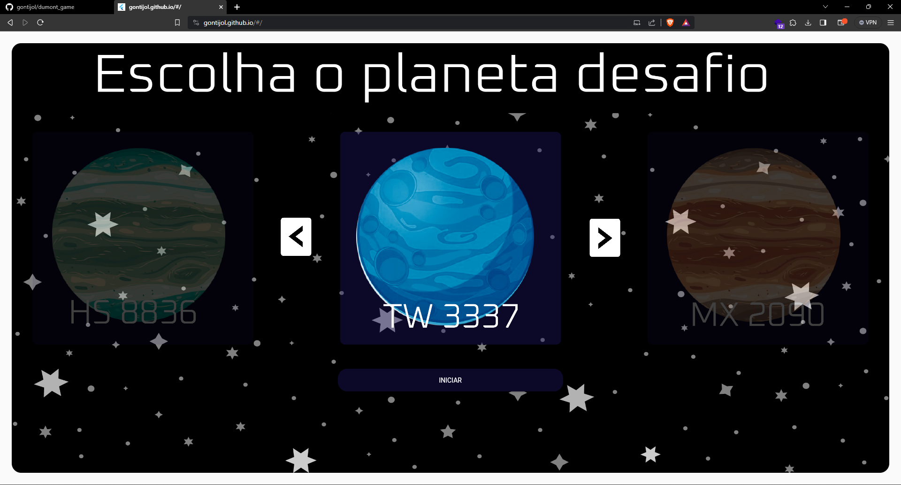

# Exploradores Científicos RPG

Bem-vindo ao repositório do jogo **Exploradores Científicos RPG**, um emocionante jogo de aventura 2D desenvolvido com Flutter, Bonfire e Flame. Neste jogo, os jogadores se tornam cientistas virtuais, exploram mundos misteriosos e resolvem desafios científicos emocionantes.



## Requisitos

- [Flutter](https://flutter.dev/) 2.0 ou superior.
- [Bonfire](https://pub.dev/packages/bonfire) e [Flame](https://pub.dev/packages/flame) instalados.

## Recursos e Funcionalidades

- Crie e explore mundos virtuais com desafios científicos únicos.
- Interaja com elementos biológicos, químicos e físicos.
- Jogue como aluno ou professor (Mestre da Ciência).
- Ganhe pontos de experiência para desbloquear novos níveis e recursos.
- Colabore com outros jogadores para resolver desafios científicos.
- Identifique e expulse sabotadores para manter a aprendizagem em andamento.

## Como Iniciar

1. Instale as dependências:

   ```bash
   flutter pub get
   ```

   ```bash
   git clone https://github.com/gontijol/dumont_game.git
   ```

2. Execute o jogo:

   ```bash
    flutter run web
    ```

### Contribuições

Ficaríamos felizes com suas contribuições para tornar o Exploradores Científicos RPG ainda melhor. Sinta-se à vontade para abrir problemas, enviar solicitações de pull e contribuir com melhorias.


### Licença

Este projeto está licenciado sob a licença MIT - consulte o arquivo [LICENSE](LICENSE) para obter detalhes.